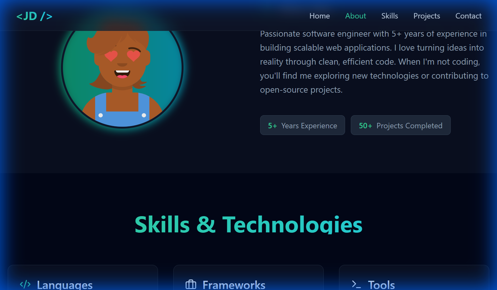
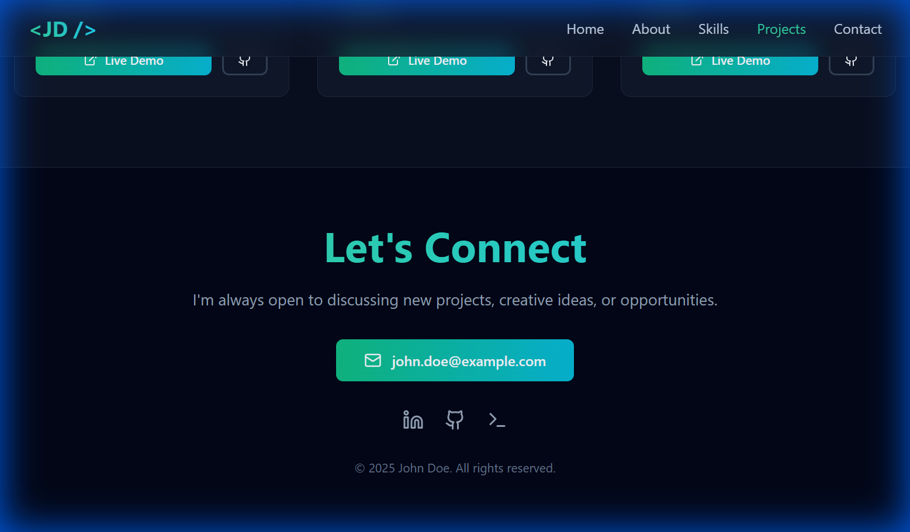
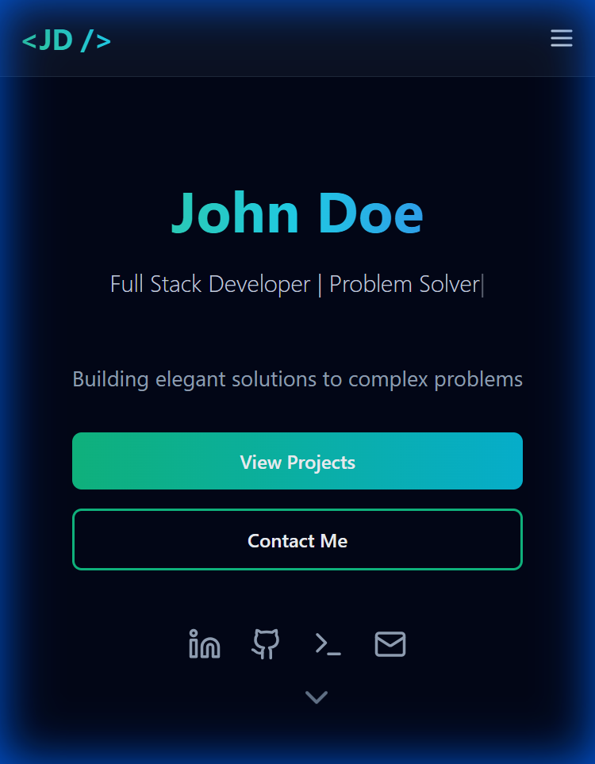

# 🌟 Personal Portfolio Website

A modern, responsive personal portfolio website built with React and Tailwind CSS, featuring stunning animations, dark mode aesthetics, and a clean single-file architecture.


## ✨ Features

- 🎨 **Modern Dark Mode Design** - Sleek slate/gray backgrounds with emerald/cyan gradient accents
- ⚡ **Continuous Typing Animations** - Dynamic typing effect in Hero and Contact sections
- 📱 **Fully Responsive** - Optimized for desktop, tablet, and mobile devices
- 🎯 **Single-File Architecture** - Easy to understand and customize
- 💫 **Smooth Animations** - Hover effects, scale transitions, and glow effects throughout
- 🔗 **Social Integration** - Quick links to LinkedIn, GitHub, LeetCode, and Email
- 🚀 **Fast Performance** - Built with Vite for lightning-fast development and builds

## 🎨 Sections

### 🏠 Hero Section
- Large gradient name display
- Continuous typing animation for title
- Call-to-action buttons with hover effects
- Social media links
- Animated scroll indicator

### 👤 About Me
- Profile avatar with gradient border
- Bio and personal information
- Experience and project statistics

### 🛠️ Skills
- Categorized skill display (Languages, Frameworks, Tools)
- Interactive pill badges
- Icons for each category

### 💼 Projects
- Grid layout of project cards
- Tech stack badges
- Live demo and GitHub links
- Hover animations on cards

### 📬 Contact
- Animated "Let's Connect" heading
- Email contact button
- Social media links
- Copyright information

## 🖼️ Screenshots

### Desktop View




### Mobile View


## 🚀 Tech Stack

- **Frontend Framework:** React 18.2
- **Build Tool:** Vite 5.0
- **Styling:** Tailwind CSS 3.3
- **Icons:** Lucide React
- **Language:** JavaScript (JSX)

## 📦 Installation

1. **Clone the repository:**
   ```bash
   git clone https://github.com/yourusername/portfolio-website.git
   cd portfolio-website
   ```

2. **Install dependencies:**
   ```bash
   npm install
   ```

3. **Start development server:**
   ```bash
   npm run dev
   ```

4. **Open in browser:**
   ```
   http://localhost:5173
   ```

## 🏗️ Build for Production

```bash
npm run build
```

The production-ready files will be in the `dist` folder.

## 🎯 Customization

All personal data is centralized in `src/Portfolio.jsx`. Simply edit these three objects:

### 1. Personal Details
```javascript
const personalDetails = {
  name: "Your Name",
  title: "Your Title | Your Expertise",
  tagline: "Your catchy tagline",
  bio: "Your bio...",
  email: "your.email@example.com",
  social: {
    github: "https://github.com/yourusername",
    linkedin: "https://linkedin.com/in/yourusername",
    leetcode: "https://leetcode.com/yourusername"
  },
  avatar: "URL to your avatar"
};
```

### 2. Skills
```javascript
const skills = {
  languages: ["Your", "Languages"],
  frameworks: ["Your", "Frameworks"],
  tools: ["Your", "Tools"]
};
```

### 3. Projects
```javascript
const projects = [
  {
    id: 1,
    title: "Project Name",
    description: "Description",
    techStack: ["Tech1", "Tech2"],
    liveDemo: "https://demo-link.com",
    github: "https://github.com/repo"
  },
  // Add more projects...
];
```

## 🎨 Color Scheme

- **Background:** `#020617` (slate-950)
- **Surfaces:** `#0f172a` (slate-900)
- **Borders:** `#1e293b` (slate-800)
- **Primary Text:** `#f1f5f9` (slate-100)
- **Accent Gradient:** Emerald (400) → Cyan (400) → Blue (500)

## 📁 Project Structure

```
portfolio-website/
├── public/
├── src/
│   ├── Portfolio.jsx    # Main component (all-in-one)
│   ├── main.jsx         # React entry point
│   └── index.css        # Global styles
├── index.html           # HTML template
├── package.json         # Dependencies
├── vite.config.js       # Vite configuration
├── tailwind.config.js   # Tailwind configuration
└── postcss.config.js    # PostCSS configuration
```

## 🌐 Deployment

### Deploy to GitHub Pages
```bash
npm install gh-pages --save-dev
# Add to package.json scripts:
# "deploy": "gh-pages -d dist"
npm run build
npm run deploy
```

## 📝 License

MIT License - feel free to use this template for your own portfolio!

## 🤝 Contributing

Contributions, issues, and feature requests are welcome!

## 👨‍💻 Author

**Pulakesh Deb Roy**

- LinkedIn: [Pulakesh Deb Roy](https://www.linkedin.com/in/pulakesh-deb-roy-7b058a249)
- Email: pulakesh2609@gmail.com

---

⭐ **Star this repo if you found it helpful!**

Made with ❤️ using React & Tailwind CSS
